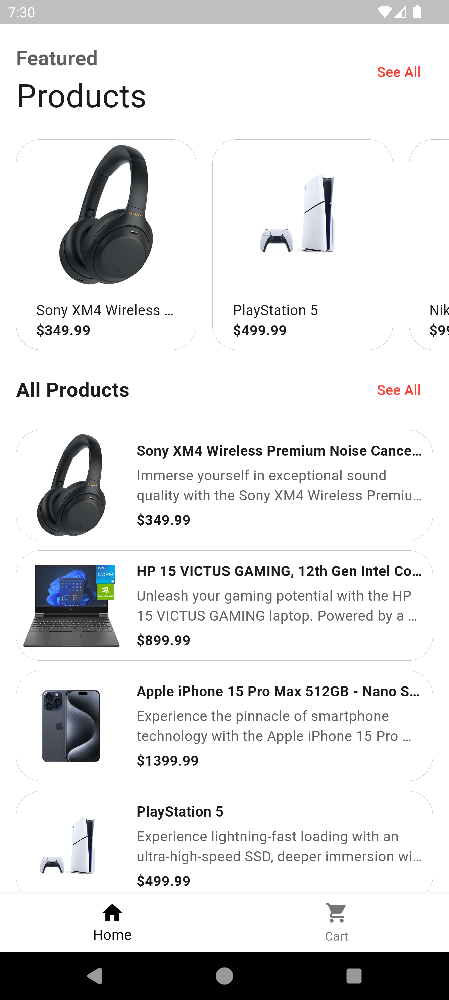
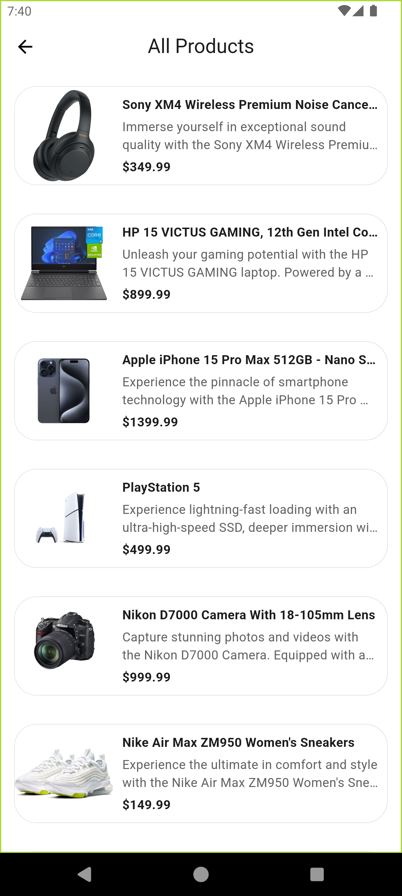
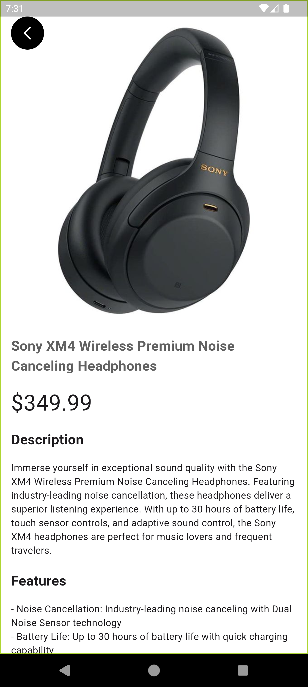
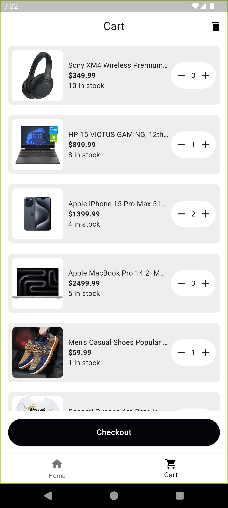
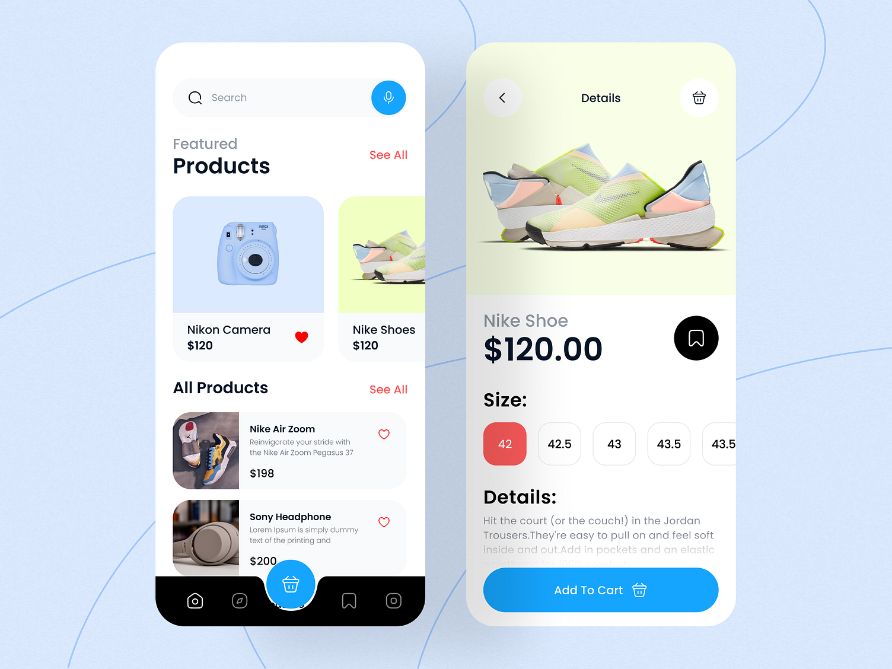

# One Shop

One Shop is a simple online shop application built for the HNG11 task 1, showcasing a shopping experience with no third-party dependencies. The app features a product list, detailed product pages, and a checkout system, all implemented using native Flutter components.

## Features

- **Product List**: Browse a list of available products.
- **Product Details**: View detailed information about each product, including description, image, price, and available quantity.
- **Add to Checkout**: Add products to the checkout list while respecting available stock.
- **Checkout**: Review your selected products, adjust quantities, and place your order.
- **Order Success**: Receive confirmation of your successful order.

## Getting Started

This project is a starting point for a Flutter application. To get started with this project:

1. **Clone the repository**:

   ```bash
   git clone https://github.com/One-Marvellous/oneshop.git
   cd oneshop
   ```

2. **Install dependencies**:

   ```bash
   flutter pub get
   ```

3. **Run the application**:

   ```bash
   flutter run
   ```

## Screenshots

|  |  |
|:------------------------------------------:|:------------------------------------------:|

|  |  |
|:------------------------------------------:|:------------------------------------------:|

|  |  |
|:------------------------------------------:|:------------------------------------------:|

|  |  |
|:------------------------------------------:|:------------------------------------------:|

## Credits

The reference image used in the project is sourced from [Dribbble](https://dribbble.com/shots/20759854-Shoe-store-ios-app), designed by [Awe Mobile App](https://dribbble.com/awe_mobileapp).


*Reference image from dribble.*

## Resources

A few resources to get you started if this is your first Flutter project:

- [Lab: Write your first Flutter app](https://docs.flutter.dev/get-started/codelab)
- [Cookbook: Useful Flutter samples](https://docs.flutter.dev/cookbook)

For help getting started with Flutter development, view the [online documentation](https://docs.flutter.dev/), which offers tutorials, samples, guidance on mobile development, and a full API reference.
